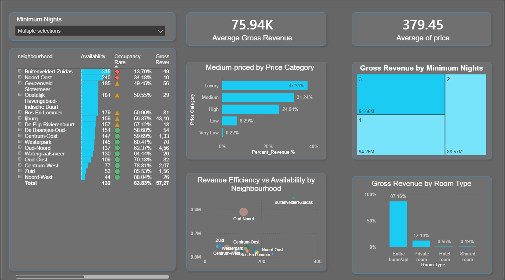

# 🏠 Airbnb Amsterdam Analytics Dashboard

## 📌 Introduction

This project is an interactive Power BI dashboard built to analyze Airbnb listings data in Amsterdam.

The main goal of the project is to transform raw marketplace data into clear business insights related to pricing strategy, occupancy performance, revenue distribution, and neighborhood efficiency.

The dashboard helps understand how different factors — such as price category, room type, availability, and minimum stay requirements — impact overall gross revenue.

This project demonstrates a full analytics workflow:
- SQL-based data cleaning and preparation
- Business logic implementation
- KPI development
- Data modeling
- Interactive dashboard design in Power BI

---

# 🧠 Business Use Case

This dashboard is designed to support data-driven decision making for:

- Airbnb hosts
- Property investors
- Revenue managers
- Real estate analysts
- Marketplace analysts

It helps answer the following business questions:

### 💰 Revenue Optimization
- Which neighborhoods generate the highest gross revenue?
- Which price segment contributes the most to total revenue?
- Are luxury listings outperforming mid-range properties?

### 📊 Performance & Efficiency
- How does availability impact revenue efficiency?
- Which neighborhoods have high supply but low revenue performance?
- Where is demand stronger relative to listing availability?

### 🏠 Listing Strategy
- Which room type generates the highest share of revenue?
- How do minimum night requirements affect gross revenue?
- Are stricter stay policies reducing booking potential?

The insights from this dashboard can be used to:

- Optimize pricing strategy
- Adjust minimum stay policies
- Identify high-performing neighborhoods
- Improve listing positioning
- Benchmark revenue performance

---

# 🛠 Data Preparation & Cleaning

Raw Airbnb data required significant cleaning before analysis.

The following steps were performed using PostgreSQL:

- Removed listings outside Amsterdam geographical boundaries
- Eliminated duplicate listings using window functions
- Standardized neighborhood naming conventions
- Cleaned text fields (trimmed spaces, normalized formatting)
- Removed invalid and null price records
- Cleaned HTML tags from review comments
- Validated price distribution using percentile analysis
- Created price segmentation categories for business analysis

After cleaning, a structured and enriched dataset was created for analytical modeling.

---

# 📊 Dashboard Overview

The dashboard includes:

### 🔢 KPI Cards
- Average Gross Revenue
- Average Price

### 📍 Neighborhood Analysis
- Availability by neighborhood
- Occupancy rate comparison
- Revenue efficiency vs availability (bubble chart)

### 💵 Pricing Analysis
- Revenue distribution by price category
- Identification of dominant market segments

### 🏠 Room Type Analysis
- Revenue share by:
  - Entire home/apartment
  - Private room
  - Hotel room
  - Shared room

### 📆 Minimum Nights Impact
- Gross revenue distribution based on minimum stay requirements

### 🎛 Interactive Filtering
- Dynamic slicers for minimum nights
- Cross-filtering across visuals
- Interactive business exploration

---

# 🔎 Key Insights

- Entire homes/apartments dominate total revenue share.
- Mid-range and high-price categories generate the largest portion of revenue.
- Some neighborhoods show high availability but lower revenue efficiency.
- Luxury listings do not always generate the highest revenue share.
- Revenue concentration varies significantly depending on minimum stay policies.

---

# 💡 Analytical Value

This project highlights my ability to:

- Work with imperfect, real-world datasets
- Perform structured SQL-based data cleaning
- Apply business logic to raw marketplace data
- Build analytical KPIs aligned with business goals
- Design clean, executive-level dashboards
- Communicate insights through visual storytelling

---

# 🛠 Tools & Technologies

- PostgreSQL (Data Cleaning & Transformation)
- SQL (Window Functions, Data Validation, Data Enrichment)
- Power BI
- Data Modeling
- DAX
- Business Intelligence & Dashboard Design

---

# 🚀 Conclusion

This project demonstrates how raw marketplace data can be transformed into actionable business intelligence.

It combines backend data preparation with frontend analytics visualization, showcasing both technical and analytical skills required for data-driven decision making.

The dashboard provides a clear, business-focused overview of Airbnb market performance in Amsterdam and supports strategic pricing and investment decisions.
